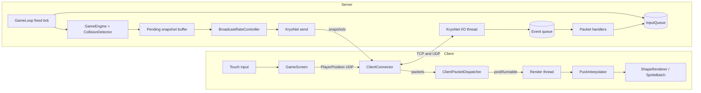
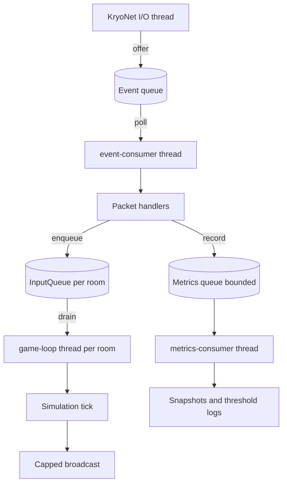
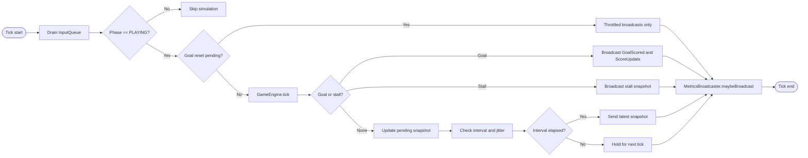
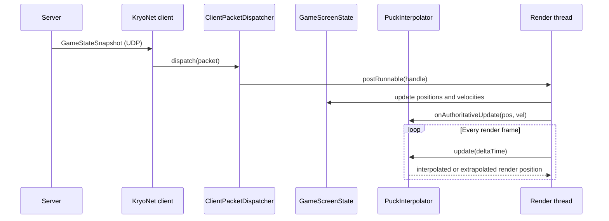
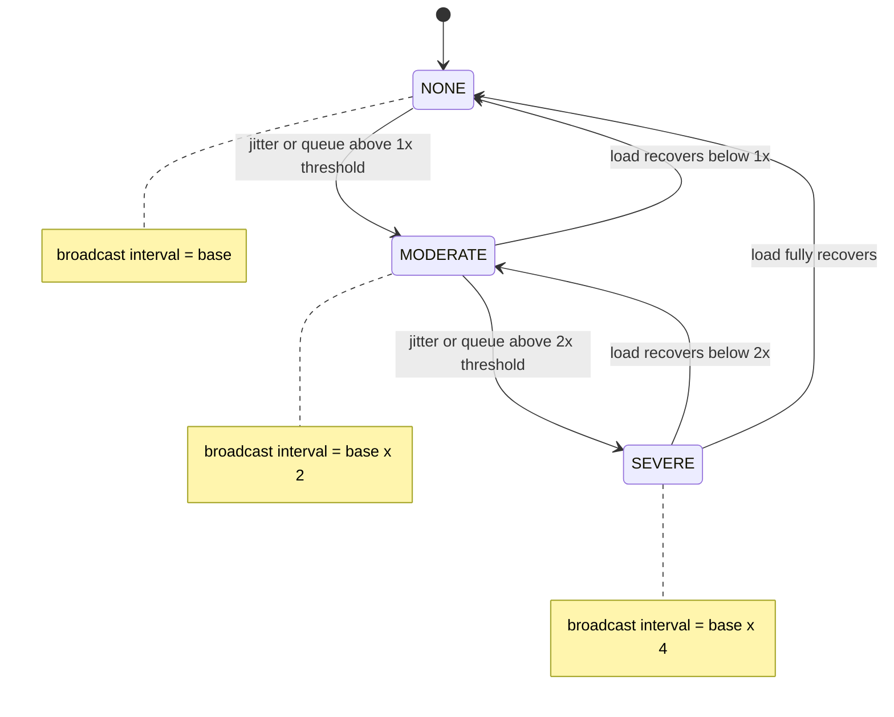
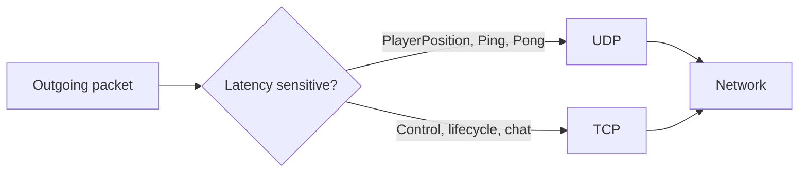

# Ping404 Performance Tactics and LibGDX Usage

Date: 2026-05-26

## 1. Complete Summary of Performance Tactics

### 1.1 Server simulation and timing

A nanosecond accumulator with sleep then catch up gives a stable 60 Hz delta to the physics step, which the deterministic collision code requires to produce identical results across clients. The catch up skip threshold trades short term temporal accuracy for recovery, because unbounded catch up after a GC pause or thread starvation would cascade into more jitter rather than recovering. Sleeping before the deadline (instead of busy spinning) avoids burning CPU that other rooms in the same JVM need.

1. The server uses a dedicated fixed tick loop, target 60 Hz by default.
2. Tick timing is based on nanoseconds.
3. The loop sleeps before tick deadlines.
4. If it falls behind too far, it skips catch up work to recover quickly.
5. This limits jitter cascades and protects responsiveness under load.

Primary references:
1. [server/src/main/java/no/ntnu/ping404/server/game/GameLoop.java](server/src/main/java/no/ntnu/ping404/server/game/GameLoop.java)
2. [core/src/main/java/no/ntnu/ping404/network/GameConfig.java](core/src/main/java/no/ntnu/ping404/network/GameConfig.java)

### 1.2 Broadcast rate limiting and adaptive backpressure

The broadcast cap is decoupled from the simulation tick so the server can simulate at 60 Hz while sending at a lower fixed rate (for example 30 Hz), reducing per client bandwidth and serialization cost without affecting physics fidelity. The adaptive multiplier (1x, 2x, 4x) reacts to loop jitter and metrics queue depth, which are the two earliest leading indicators of overload, so the server sheds outbound work before TCP buffers and Kryo write queues start growing.

1. State snapshots are broadcast at a capped rate, independent from simulation tick rate.
2. Effective broadcast interval is dynamically increased under load.
3. Backpressure signals include loop jitter and metrics queue depth.
4. The controller has moderate and severe levels.
5. This protects network and CPU during overload.

Primary references:
1. [server/src/main/java/no/ntnu/ping404/server/game/BroadcastRateController.java](server/src/main/java/no/ntnu/ping404/server/game/BroadcastRateController.java)
2. [server/src/main/java/no/ntnu/ping404/server/game/GameLoop.java](server/src/main/java/no/ntnu/ping404/server/game/GameLoop.java)

### 1.3 Snapshot coalescing instead of backlog growth

A single mutable `pendingStateSnapshot` field replaces any unsent state every tick, so when the broadcast interval finally elapses only the newest world state is serialized and sent. This avoids a queue of obsolete snapshots that would each cost serialization, bandwidth, and effectively raise client perceived latency, while preserving the property that clients always converge to the most recent authoritative state.

1. The loop keeps a pending state snapshot buffer.
2. Intermediate stale snapshots are replaced by fresh state.
3. Only the latest state is sent when interval allows.
4. This reduces unnecessary network traffic and avoids snapshot queue buildup.

Primary reference:
1. [server/src/main/java/no/ntnu/ping404/server/game/GameLoop.java](server/src/main/java/no/ntnu/ping404/server/game/GameLoop.java)

### 1.4 Producer consumer decoupling across critical paths

KryoNet callbacks run on a single I O thread, so any handler that blocks (room creation, metrics IO, logging) would stall every connection. Pushing events onto `LinkedBlockingQueue` instances handled by dedicated consumer threads keeps the network thread strictly bounded to deserialize and enqueue. The same pattern in `InputQueue` lets the game loop pull inputs exactly at tick boundaries, which gives deterministic input ordering relative to physics.

1. Game input from network handlers is queued and drained once per tick.
2. Server network events are queued off the KryoNet I/O thread.
3. Client network events are queued off the KryoNet I/O thread.
4. Metrics events are queued and processed by a dedicated consumer thread.
5. This ensures slow handlers do not block simulation or I/O threads.

Primary references:
1. [server/src/main/java/no/ntnu/ping404/server/game/InputQueue.java](server/src/main/java/no/ntnu/ping404/server/game/InputQueue.java)
2. [core/src/main/java/no/ntnu/ping404/network/NetworkKryoServer.java](core/src/main/java/no/ntnu/ping404/network/NetworkKryoServer.java)
3. [core/src/main/java/no/ntnu/ping404/network/NetworkKryoClient.java](core/src/main/java/no/ntnu/ping404/network/NetworkKryoClient.java)
4. [server/src/main/java/no/ntnu/ping404/server/metrics/MetricsCollector.java](server/src/main/java/no/ntnu/ping404/server/metrics/MetricsCollector.java)

### 1.5 Bounded queues and explicit drop accounting

A `LinkedBlockingQueue` with `MAX_QUEUE_CAPACITY = 10_000` plus non blocking `offer()` ensures the producing thread (game loop) never blocks on the metrics consumer, even if disk IO or log encoding stalls. Drops are counted in an `AtomicLong` rather than silently lost, so backpressure logic can read the counter and downstream operators can detect when sampling fidelity is degraded.

1. Metrics ingestion queue has a fixed max capacity.
2. Overflowed events are dropped instead of allowing unbounded memory growth.
3. Dropped event count is tracked for observability.

Primary reference:
1. [server/src/main/java/no/ntnu/ping404/server/metrics/MetricsCollector.java](server/src/main/java/no/ntnu/ping404/server/metrics/MetricsCollector.java)

### 1.6 Transport split by packet type

`PlayerPosition`, `Ping`, and `Pong` are sent over UDP because losing one out of N updates is irrelevant when a newer position arrives within milliseconds, and TCP head of line blocking would force the whole position stream to wait on a single retransmission. Match lifecycle, score, and lobby packets use TCP because exactly once ordered delivery is required to keep client and server state machines in agreement.

1. Latency sensitive high rate packets use UDP, for example player position and heartbeat packets.
2. Reliability sensitive packets use TCP, for example control and match flow events.
3. This balances latency, packet loss tolerance, and consistency needs.

Primary reference:
1. [core/src/main/java/no/ntnu/ping404/network/ClientConnector.java](core/src/main/java/no/ntnu/ping404/network/ClientConnector.java)

### 1.7 Heartbeat and stale connection detection

Application level `Ping` and `Pong` are used instead of relying on TCP keep alive because OS keep alive intervals are typically tens of minutes and mobile NAT timeouts are far shorter. Round trip timing on the heartbeat also doubles as the RTT signal surfaced to clients in metrics, so one mechanism serves both liveness and observability.

1. Server sends periodic heartbeat pings.
2. Client responds with pong.
3. Both sides track heartbeat timing and disconnect stale links.
4. This avoids wasted resources on dead peers.

Primary references:
1. [core/src/main/java/no/ntnu/ping404/network/NetworkKryoServer.java](core/src/main/java/no/ntnu/ping404/network/NetworkKryoServer.java)
2. [core/src/main/java/no/ntnu/ping404/network/NetworkKryoClient.java](core/src/main/java/no/ntnu/ping404/network/NetworkKryoClient.java)
3. [core/src/main/java/no/ntnu/ping404/network/NetworkConfig.java](core/src/main/java/no/ntnu/ping404/network/NetworkConfig.java)

### 1.8 Client side smoothing of authoritative snapshots

A frame rate independent exponential blend (`1 - exp(-BLEND_RATE * dt)`) is used instead of a linear lerp so the same `BLEND_RATE` constant produces identical convergence behavior whether the client runs at 60, 90, or 144 fps. `MAX_EXTRAPOLATION_TIME` caps dead reckoning so that prolonged snapshot loss cannot drift the puck through walls, and `SNAP_THRESHOLD` overrides the blend on large divergence because smoothing across a teleport sized error would look worse than a hard snap.

1. The puck is rendered through interpolation and bounded extrapolation between snapshots.
2. A snap threshold corrects large divergence quickly.
3. Exponential blend gives frame rate independent smoothing.
4. Extrapolation is capped in time to prevent runaway drift.
5. This reduces visible stutter while preserving server authority.

Primary references:
1. [core/src/main/java/no/ntnu/ping404/network/PuckInterpolator.java](core/src/main/java/no/ntnu/ping404/network/PuckInterpolator.java)
2. [core/src/main/java/no/ntnu/ping404/screens/GameScreen.java](core/src/main/java/no/ntnu/ping404/screens/GameScreen.java)

### 1.9 Runtime metrics for observability and control loops

Metrics are computed in the same threads that perform the work (tick jitter on the game loop, RTT on the network listener) to avoid sampling skew. Server snapshots are broadcast at 1 Hz to keep telemetry bandwidth negligible compared to gameplay traffic, yet still feed the backpressure controller fast enough to react before queues saturate.

1. Client computes local RTT, snapshot rate, and snapshot jitter.
2. Server computes tick rate, jitter, drop rates, queue depth, and bandwidth.
3. Server metrics are streamed to clients periodically.
4. Metrics also feed backpressure logic on the server.

Primary references:
1. [core/src/main/java/no/ntnu/ping404/network/GameScreenState.java](core/src/main/java/no/ntnu/ping404/network/GameScreenState.java)
2. [server/src/main/java/no/ntnu/ping404/server/game/MetricsBroadcaster.java](server/src/main/java/no/ntnu/ping404/server/game/MetricsBroadcaster.java)
3. [docs/metrics-overview.md](docs/metrics-overview.md)
4. [README.md](README.md)

### 1.10 Physics stability and determinism

Substep count is derived from puck travel distance per tick (`ceil(travel / (radius * factor))`) so fast pucks get more substeps and slow pucks pay nothing extra. `MAX_SUBSTEPS = 16` is a hard cap that bounds the worst case cost of one tick, which is essential because the game loop deadline must be honored regardless of input speed. Players are checked in a fixed order so two clients replaying the same input sequence get identical outcomes.

1. Collision resolution uses substeps computed from puck travel distance.
2. Substeps are capped to prevent runaway CPU cost.
3. Collision ordering is deterministic.
4. Small position epsilon values reduce tunnel and sticky edge issues.
5. This improves stability under variable speed and variable frame timing.

Primary reference:
1. [core/src/main/java/no/ntnu/ping404/utils/CollisionDetector.java](core/src/main/java/no/ntnu/ping404/utils/CollisionDetector.java)

### 1.11 Stall detection and controlled reset logic

`StuckPuckDetector` tracks how long the puck remains in one half above a low speed threshold; when this exceeds the configured timeout the server forces a relaunch toward the conceding side. The same goal reset delay path is reused for stalls, which keeps client side animation expectations consistent (clients always see the same reset sequence whether triggered by a goal or by a stall).

1. A detector tracks how long the puck remains on one half.
2. If it exceeds timeout, server resets puck and broadcasts reset state.
3. Goal reset delays are handled in the loop with controlled relaunch.
4. This prevents deadlock gameplay states and keeps matches flowing.

Primary references:
1. [core/src/main/java/no/ntnu/ping404/model/StuckPuckDetector.java](core/src/main/java/no/ntnu/ping404/model/StuckPuckDetector.java)
2. [core/src/main/java/no/ntnu/ping404/model/GameEngine.java](core/src/main/java/no/ntnu/ping404/model/GameEngine.java)
3. [server/src/main/java/no/ntnu/ping404/server/game/GameLoop.java](server/src/main/java/no/ntnu/ping404/server/game/GameLoop.java)

### 1.12 Concurrency primitives and data structures

`ConcurrentHashMap` is chosen for room and connection maps because reads dominate (every broadcast iterates connections) and lock striping keeps that read path effectively contention free. `CopyOnWriteArrayList` is used for listener lists where mutation is rare but iteration during dispatch must never throw `ConcurrentModificationException`. `AtomicLong` covers monotonic counters where a full lock would be wasteful, and `volatile` flags handle the `running` / shutdown signal where only visibility (not atomicity) is required.

1. ConcurrentHashMap is used heavily for shared server state.
2. CopyOnWriteArrayList is used for listener lists where iteration safety is critical.
3. AtomicLong is used for counters.
4. Volatile and synchronized sections are used where needed for visibility and atomic transitions.
5. This minimizes lock contention while preserving thread safety.

Primary references:
1. [server/src/main/java/no/ntnu/ping404/server/GameServer.java](server/src/main/java/no/ntnu/ping404/server/GameServer.java)
2. [server/src/main/java/no/ntnu/ping404/server/GameRoom.java](server/src/main/java/no/ntnu/ping404/server/GameRoom.java)
3. [server/src/main/java/no/ntnu/ping404/server/metrics/RoomMetrics.java](server/src/main/java/no/ntnu/ping404/server/metrics/RoomMetrics.java)
4. [server/src/main/java/no/ntnu/ping404/server/SessionStore.java](server/src/main/java/no/ntnu/ping404/server/SessionStore.java)

### 1.13 Render thread safety for UI state mutation

LibGDX `OpenGL` and most `Gdx.*` APIs are only safe to call on the render thread, and game state read by `render()` must not change mid frame. Routing every packet handler through `Gdx.app.postRunnable` collapses the threading model on the client to one mutator (render thread) and many readers, which eliminates the need for locks in screen state.

1. Packet handlers post state updates to the LibGDX render thread.
2. This avoids UI side race conditions between network and render threads.

Primary references:
1. [core/src/main/java/no/ntnu/ping404/network/ClientPacketDispatcher.java](core/src/main/java/no/ntnu/ping404/network/ClientPacketDispatcher.java)
2. [core/src/main/java/no/ntnu/ping404/screens/BaseScreen.java](core/src/main/java/no/ntnu/ping404/screens/BaseScreen.java)

### 1.14 Resource lifetime management

LibGDX `Texture`, `BitmapFont`, `SpriteBatch`, `ShapeRenderer`, `Sound`, and `Music` hold native GPU and audio handles that the JVM garbage collector cannot release. Disposing them in matching `dispose()` calls and `hide()` transitions keeps the native memory footprint flat across many screen switches, which is critical on Android where the OS will kill the process under memory pressure.

1. Rendering and audio resources are created in lifecycle entry points.
2. Textures, fonts, batch, shape renderer, sounds, and music are disposed explicitly.
3. This avoids leaks and long session performance degradation.

Primary references:
1. [core/src/main/java/no/ntnu/ping404/screens/BaseScreen.java](core/src/main/java/no/ntnu/ping404/screens/BaseScreen.java)
2. [core/src/main/java/no/ntnu/ping404/screens/HomeScreen.java](core/src/main/java/no/ntnu/ping404/screens/HomeScreen.java)
3. [core/src/main/java/no/ntnu/ping404/audio/AudioManager.java](core/src/main/java/no/ntnu/ping404/audio/AudioManager.java)

### 1.15 Allocation awareness on hot paths

A single `Vector3 touchPos` field is reused for every `unproject` call, and `GlyphLayout` instances are cached per renderer. The intent is not zero allocation but to eliminate the per frame churn that triggers young generation GC on Android, where collection pauses are visible as frame stutter. Where allocations remain (for example defensive `Vector2` copies in snapshots) they are kept off the per frame path.

1. Reusable touch vectors and layouts are used in rendering and input code.
2. Some allocations remain, for example Vector2 copies in snapshot creation and getters, but heavy per frame churn is reduced in critical paths.

Primary references:
1. [core/src/main/java/no/ntnu/ping404/screens/GameInputHandler.java](core/src/main/java/no/ntnu/ping404/screens/GameInputHandler.java)
2. [core/src/main/java/no/ntnu/ping404/screens/BaseScreen.java](core/src/main/java/no/ntnu/ping404/screens/BaseScreen.java)
3. [core/src/main/java/no/ntnu/ping404/screens/AbstractGameRenderer.java](core/src/main/java/no/ntnu/ping404/screens/AbstractGameRenderer.java)

## 2. Complete Summary of LibGDX Usage

### 2.1 App lifecycle and screen model

Using `com.badlogic.gdx.Game` as the root means the framework already routes `pause()`, `resume()`, and `resize()` to the active `Screen`, which is essential on Android where these events fire on every focus change. Implementing flow as discrete screens (`HomeScreen`, `HostScreen`, `JoinScreen`, `GameScreen`, `GameOverScreen`) keeps each scene's resources and input handling local, so disposal is straightforward and screens never leak input processors into the next scene.

1. The game uses com.badlogic.gdx.Game as the app root.
2. Screens are used for menu, host, join, game, game over, and settings flows.
3. App pause and resume events are forwarded to lifecycle aware screens.

Primary reference:
1. [core/src/main/java/no/ntnu/ping404/screens/Ping404Game.java](core/src/main/java/no/ntnu/ping404/screens/Ping404Game.java)

### 2.2 Platform backends

The desktop launcher uses `Lwjgl3Application` directly so it can configure window size, title, and GL settings explicitly, while the Android launcher extends `AndroidApplication` to integrate with the Activity lifecycle. `useWakelock = true` on Android prevents the screen from dimming during gameplay, which is required because the player's thumb stays in one position and Android would otherwise treat the device as idle.

1. Desktop uses LWJGL3 backend through Lwjgl3Application.
2. Android uses AndroidApplication backend.
3. Android enables wakelock to avoid unintended sleep during gameplay.

Primary references:
1. [desktop/src/main/java/no/ntnu/ping404/desktop/DesktopLauncher.java](desktop/src/main/java/no/ntnu/ping404/desktop/DesktopLauncher.java)
2. [android/src/main/java/no/ntnu/ping404/android/AndroidLauncher.java](android/src/main/java/no/ntnu/ping404/android/AndroidLauncher.java)

### 2.3 Rendering pipeline

`SpriteBatch` is used for text and any textured draw because it batches by texture and minimizes GL state changes, while `ShapeRenderer` is used for the puck, paddles, and board because these are simple geometry that does not need a texture binding. `OrthographicCamera` plus `ExtendViewport` is chosen over `FitViewport` so the playable area stays centered on every aspect ratio without letterboxing, which matters across phone and desktop window sizes.

1. SpriteBatch is used for text and textured drawing.
2. ShapeRenderer is used for geometric game elements and custom UI.
3. GL20 calls handle clear and alpha blending states.
4. OrthographicCamera and ExtendViewport provide world projection and adaptive sizing.

Primary references:
1. [core/src/main/java/no/ntnu/ping404/screens/BaseScreen.java](core/src/main/java/no/ntnu/ping404/screens/BaseScreen.java)
2. [core/src/main/java/no/ntnu/ping404/screens/AbstractGameRenderer.java](core/src/main/java/no/ntnu/ping404/screens/AbstractGameRenderer.java)
3. [core/src/main/java/no/ntnu/ping404/screens/GameScreen.java](core/src/main/java/no/ntnu/ping404/screens/GameScreen.java)

### 2.4 Input model

Polling `Gdx.input` directly inside `render()` lets paddle movement react in the same frame the touch occurs, which gives the lowest possible local input latency. `Viewport.unproject` is required because raw touch coordinates are in screen pixels while the game logic operates in world units; doing the conversion through the viewport guarantees the mapping stays correct across resizes and aspect changes without manual math.

1. Gdx.input is used directly for touch and keyboard state.
2. InputAdapter is used for inline text input and key events.
3. Viewport unproject maps screen touches to world coordinates.
4. Platform specific gestures are used for debug overlay activation.

Primary references:
1. [core/src/main/java/no/ntnu/ping404/screens/BaseScreen.java](core/src/main/java/no/ntnu/ping404/screens/BaseScreen.java)
2. [core/src/main/java/no/ntnu/ping404/screens/GameInputHandler.java](core/src/main/java/no/ntnu/ping404/screens/GameInputHandler.java)
3. [core/src/main/java/no/ntnu/ping404/screens/GameScreen.java](core/src/main/java/no/ntnu/ping404/screens/GameScreen.java)
4. [core/src/main/java/no/ntnu/ping404/screens/AndroidGameRenderer.java](core/src/main/java/no/ntnu/ping404/screens/AndroidGameRenderer.java)

### 2.5 Math and geometry utilities

`Vector2` is used for puck position, velocity, and paddle state because the game is strictly 2D; storing only x and y halves memory traffic and removes an unused z component from every snapshot field. `Vector3` is used specifically for `Viewport.unproject` because that API requires a 3D input even in 2D scenes (the z axis carries depth in the projection matrix). `Rectangle` is used for hit testing buttons because its `contains(x, y)` is faster and clearer than manual coordinate comparisons, and `MathUtils.clamp` is used to keep paddle position inside bounds without writing branchy if blocks.

1. Vector2 is used for game state and interpolation vectors.
2. Vector3 is used for touch unprojection.
3. Rectangle is used for hit testing and button bounds.
4. MathUtils is used for clamp and geometry calculations.

Primary references:
1. [core/src/main/java/no/ntnu/ping404/network/PuckInterpolator.java](core/src/main/java/no/ntnu/ping404/network/PuckInterpolator.java)
2. [core/src/main/java/no/ntnu/ping404/screens/GameInputHandler.java](core/src/main/java/no/ntnu/ping404/screens/GameInputHandler.java)
3. [core/src/main/java/no/ntnu/ping404/screens/BaseScreen.java](core/src/main/java/no/ntnu/ping404/screens/BaseScreen.java)

### 2.6 Audio and preferences

A single `AudioManager` owns all `Sound` and `Music` handles so a screen transition that forgets to dispose audio cannot leak a handle, and so mute / volume changes apply globally instantly. LibGDX `Preferences` is chosen over rolling a custom file because it already abstracts the platform difference between desktop config files and Android `SharedPreferences`, and it persists session reconnect data (player name, last server) so the user does not retype on every launch.

1. Sound and Music are used through a singleton audio manager.
2. Preferences API stores audio flags and user settings.
3. Preferences also store session reconnect metadata.

Primary references:
1. [core/src/main/java/no/ntnu/ping404/audio/AudioManager.java](core/src/main/java/no/ntnu/ping404/audio/AudioManager.java)
2. [core/src/main/java/no/ntnu/ping404/utils/PreferencesManager.java](core/src/main/java/no/ntnu/ping404/utils/PreferencesManager.java)

### 2.7 Render thread handoff

KryoNet delivers packets on its own thread, but most state read by `render()` (current screen, player list, score, puck snapshot) is not synchronized. `Gdx.app.postRunnable` schedules the mutation to run between frames on the render thread, which makes the update atomic relative to rendering without requiring locks or volatile fields on every UI variable.

1. Gdx.app.postRunnable is used so packet driven UI state changes execute on the render thread.

Primary references:
1. [core/src/main/java/no/ntnu/ping404/network/ClientPacketDispatcher.java](core/src/main/java/no/ntnu/ping404/network/ClientPacketDispatcher.java)
2. [core/src/main/java/no/ntnu/ping404/screens/BaseScreen.java](core/src/main/java/no/ntnu/ping404/screens/BaseScreen.java)

### 2.8 Platform specific renderer selection

`AbstractGameRenderer` holds all the shared draw logic (board, puck, paddles, score), while `DesktopGameRenderer` and `AndroidGameRenderer` only override the parts that differ (touch hint overlays, FPS counter, debug gestures). `GameRendererFactory` picks the correct one based on `Gdx.app.getType()` at startup, so gameplay code never branches on platform during rendering.

1. Runtime platform detection selects desktop or android renderer implementation.
2. Shared rendering logic stays in an abstract renderer base.
3. Platform overlays and hints are implemented in specialized classes.

Primary references:
1. [core/src/main/java/no/ntnu/ping404/screens/GameRendererFactory.java](core/src/main/java/no/ntnu/ping404/screens/GameRendererFactory.java)
2. [core/src/main/java/no/ntnu/ping404/screens/AbstractGameRenderer.java](core/src/main/java/no/ntnu/ping404/screens/AbstractGameRenderer.java)
3. [core/src/main/java/no/ntnu/ping404/screens/DesktopGameRenderer.java](core/src/main/java/no/ntnu/ping404/screens/DesktopGameRenderer.java)
4. [core/src/main/java/no/ntnu/ping404/screens/AndroidGameRenderer.java](core/src/main/java/no/ntnu/ping404/screens/AndroidGameRenderer.java)

### 2.9 Important LibGDX features not used

`Scene2D` is skipped because the UI is sparse (a handful of buttons and labels per screen) and bringing in `Stage` plus `Actor` would add an event system and a second input router that compete with the direct `Gdx.input` polling already used for gameplay. `AssetManager` is skipped because the asset count is small and loading happens once at startup, so synchronous loads keep the code simpler than wiring up async load callbacks. `Box2D` is skipped because puck physics is intentionally a custom solver: an air hockey puck has only one moving body and a few static walls, so a hand written impulse model is both faster and easier to make deterministic than configuring a general physics engine.

1. Scene2D is not used.
2. AssetManager is not used.
3. Box2D is not used.
4. The project uses custom immediate mode style rendering and custom screen logic.

## 3. Architecture Map: Tactic to Risk Mitigation

| Tactic | Main Risk Mitigated | How It Mitigates | Main Tradeoff |
|---|---|---|---|
| Fixed tick game loop | Unstable simulation timing | Uses deterministic tick duration and drift handling | Needs careful overload controls |
| Catch up skip threshold | Spiral of death under lag | Resyncs clock instead of infinite catch up | Temporal precision can be reduced during overload |
| Broadcast rate cap | Network saturation | Limits snapshot frequency to configured max | Lower temporal granularity at client |
| Adaptive backpressure | CPU and queue overload | Reduces effective broadcast frequency based on load | Less frequent updates while overloaded |
| Snapshot coalescing | Snapshot backlog growth | Keeps only latest state to send | Intermediate state details are dropped |
| Producer consumer event queues | I/O thread blocking | Moves heavy handling off network threads | Requires queue sizing and monitoring |
| Bounded metrics queue | Unbounded memory growth | Drops excess events after hard cap | Some observability samples are lost |
| UDP for high rate packets | Position latency | Avoids TCP head of line behavior | Packet loss must be tolerated |
| TCP for control packets | Control message loss | Reliable delivery for critical flow | Higher latency and ordering overhead |
| Heartbeat stale detection | Zombie connections | Actively disconnects inactive peers | Sensitivity tuning is required |
| Puck interpolation and extrapolation | Visible stutter | Smooth render between snapshots | Can diverge briefly before correction |
| Snap threshold correction | Long visual drift | Quickly snaps on large deviation | Visual pop when threshold exceeded |
| Substepped collision resolution | Tunneling at high speed | Splits movement into smaller collision checks | Additional CPU cost |
| Substep hard cap | Worst case CPU blowup | Bounds computational cost | Extreme speeds can lose precision |
| Deterministic collision ordering | Cross run inconsistency | Stable ordering of player collision checks | Slight implementation complexity |
| Metrics driven feedback loop | Blind operations | Surfaces jitter, drops, queue depth, bandwidth | Telemetry overhead |
| Render thread post runnable dispatch | UI race conditions | Ensures thread safe state mutation | Small dispatch latency |
| Explicit resource disposal | Long run degradation and leaks | Releases graphics and audio resources | Requires strict lifecycle discipline |

## 4. Quick Practical Read

1. The project prioritizes stable server authority with controlled network output.
2. The client prioritizes smooth perception through interpolation and lightweight metrics.
3. The architecture emphasizes decoupling via queues and careful thread ownership.
4. LibGDX is used directly for rendering, input, lifecycle, audio, and persistence, without Scene2D or AssetManager abstractions.

## 5. Short Code Examples

Each snippet shows the essence of one tactic, not the full implementation.

### 5.1 Fixed tick loop with catch up skip

From [server/src/main/java/no/ntnu/ping404/server/game/GameLoop.java](server/src/main/java/no/ntnu/ping404/server/game/GameLoop.java#L173):

```java
long nextTick = System.nanoTime();
while (running) {
    long now = System.nanoTime();
    if (now < nextTick) {
        Thread.sleep((nextTick - now) / 1_000_000);
        continue;
    }
    latestLoopJitterMs = jitterMonitor.measure(now);
    tick(simulationTickDeltaSeconds);
    nextTick += simulationTickDurationNs;

    // If far behind, resync instead of unbounded catch up
    if (System.nanoTime() - nextTick > simulationTickDurationNs * CATCHUP_SKIP_THRESHOLD_TICKS) {
        nextTick = System.nanoTime();
    }
}
```

### 5.2 Adaptive broadcast backpressure

From [server/src/main/java/no/ntnu/ping404/server/game/BroadcastRateController.java](server/src/main/java/no/ntnu/ping404/server/game/BroadcastRateController.java):

```java
int nextMultiplier = switch (detectLevel()) {
    case SEVERE   -> SEVERE_MULTIPLIER;   // 4x interval
    case MODERATE -> MODERATE_MULTIPLIER; // 2x interval
    case NONE     -> NO_MULTIPLIER;       // 1x interval
};
multiplier = nextMultiplier;

float effectiveIntervalSeconds() {
    return baseBroadcastIntervalSeconds * multiplier;
}
```

### 5.3 Snapshot coalescing

```java
// Refresh buffer every tick so stale intermediates are replaced by current state
pendingStateSnapshot = createStateSnapshot();

backpressure.update(latestLoopJitterMs);
if (secondsSinceLastStateBroadcast >= backpressure.effectiveIntervalSeconds()) {
    GameStateSnapshot toSend = pendingStateSnapshot;
    pendingStateSnapshot = null;
    broadcastStateSnapshot(toSend);
}
```

### 5.4 Producer consumer for network events

From [core/src/main/java/no/ntnu/ping404/network/NetworkKryoServer.java](core/src/main/java/no/ntnu/ping404/network/NetworkKryoServer.java):

```java
@Override
public void received(Connection connection, Object object) {
    // Producer: never block the KryoNet I/O thread
    eventQueue.offer(new NetworkEvent(playerConn, EventType.RECEIVED, object));
}

// Consumer: dedicated daemon thread drains the queue
while (running || !eventQueue.isEmpty()) {
    NetworkEvent event = eventQueue.poll(100, TimeUnit.MILLISECONDS);
    if (event != null) dispatchEvent(event);
}
```

### 5.5 Bounded metrics queue with non blocking offer

From [server/src/main/java/no/ntnu/ping404/server/metrics/MetricsCollector.java](server/src/main/java/no/ntnu/ping404/server/metrics/MetricsCollector.java):

```java
private static final int MAX_QUEUE_CAPACITY = 10_000;
this.queue = new LinkedBlockingQueue<>(MAX_QUEUE_CAPACITY);

public void record(MetricEvent event) {
    if (!queue.offer(event)) {           // never blocks the game thread
        droppedEvents.incrementAndGet(); // explicit drop accounting
    }
}
```

### 5.6 UDP vs TCP transport split

From [core/src/main/java/no/ntnu/ping404/network/ClientConnector.java](core/src/main/java/no/ntnu/ping404/network/ClientConnector.java):

```java
public void send(Object packet) {
    if (isUnreliable(packet)) networkClient.sendUDP(packet);
    else                      networkClient.sendTCP(packet);
}

private static boolean isUnreliable(Object packet) {
    return packet instanceof PlayerPosition
        || packet instanceof Ping
        || packet instanceof Pong;
}
```

### 5.7 Client interpolation and bounded extrapolation

From [core/src/main/java/no/ntnu/ping404/network/PuckInterpolator.java](core/src/main/java/no/ntnu/ping404/network/PuckInterpolator.java):

```java
timeSinceUpdate += deltaTime;
float extrapolationTime = Math.min(timeSinceUpdate, MAX_EXTRAPOLATION_TIME);
float targetX = authoritativePosition.x + authoritativeVelocity.x * extrapolationTime;
float targetY = authoritativePosition.y + authoritativeVelocity.y * extrapolationTime;

// Frame rate independent exponential blend
float blendFactor = 1f - (float) Math.exp(-BLEND_RATE * deltaTime);
renderPosition.x += (targetX - renderPosition.x) * blendFactor;
renderPosition.y += (targetY - renderPosition.y) * blendFactor;

if (deviation > SNAP_THRESHOLD) {
    renderPosition.set(authoritativePosition); // hard snap on large divergence
}
```

### 5.8 Substepped, bounded collision resolution

From [core/src/main/java/no/ntnu/ping404/utils/CollisionDetector.java](core/src/main/java/no/ntnu/ping404/utils/CollisionDetector.java):

```java
private static int computeSubsteps(Puck puck, float deltaTime) {
    float travel  = speedMagnitude(puck.getVelocityX(), puck.getVelocityY()) * deltaTime;
    float maxStep = Math.max(1f, puck.getRadius() * Constants.PUCK_SUBSTEP_DISTANCE_FACTOR);
    int substeps = (int) Math.ceil(travel / maxStep);
    return Math.min(Math.max(substeps, 1), MAX_SUBSTEPS); // hard cap
}
```

### 5.9 Render thread handoff for packet driven UI updates

From [core/src/main/java/no/ntnu/ping404/network/ClientPacketDispatcher.java](core/src/main/java/no/ntnu/ping404/network/ClientPacketDispatcher.java):

```java
Runnable update = () -> handler.handle(packet);
if (Gdx.app != null) Gdx.app.postRunnable(update); // run on render thread
else                 update.run();                 // headless tests
```

### 5.10 LibGDX desktop launcher

```java
Lwjgl3ApplicationConfiguration config = new Lwjgl3ApplicationConfiguration();
config.setTitle("Ping404");
config.setWindowedMode(480, 800);
new Lwjgl3Application(new Ping404Game(), config);
```

### 5.11 LibGDX Android launcher with wakelock

```java
AndroidApplicationConfiguration config = new AndroidApplicationConfiguration();
config.useWakelock = true; // keep screen on during gameplay
initialize(new Ping404Game(), config);
```

### 5.12 Reused vectors for touch input

```java
private final Vector3 touchPos = new Vector3();          // allocate once

private Vector3 unprojectTouch() {
    touchPos.set(Gdx.input.getX(), Gdx.input.getY(), 0); // reuse instance
    viewport.unproject(touchPos);
    return touchPos;
}
```

## 6. Diagrams

### 6.1 End to end data flow



### 6.2 Server thread model



### 6.3 Tick pipeline per room



### 6.4 Client snapshot smoothing



### 6.5 Backpressure state machine



### 6.6 Transport selection


