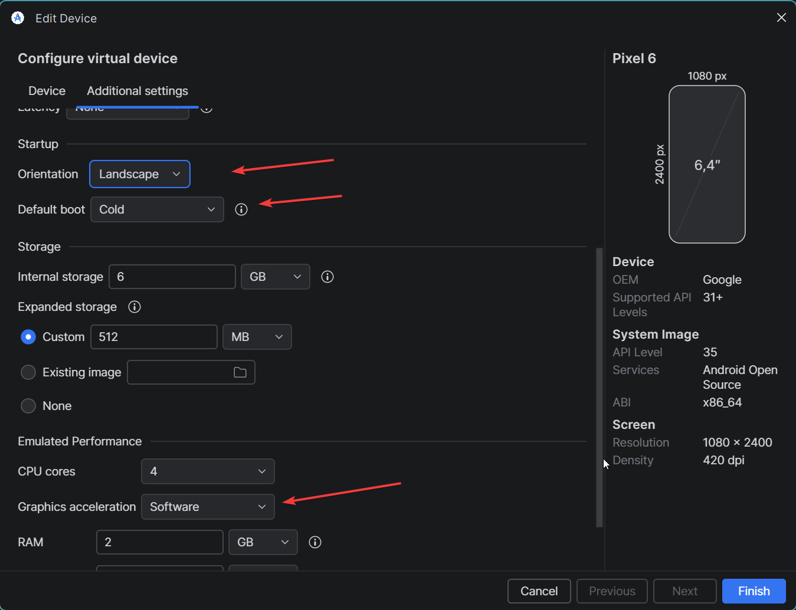
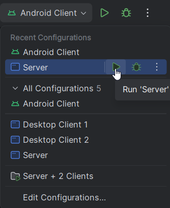
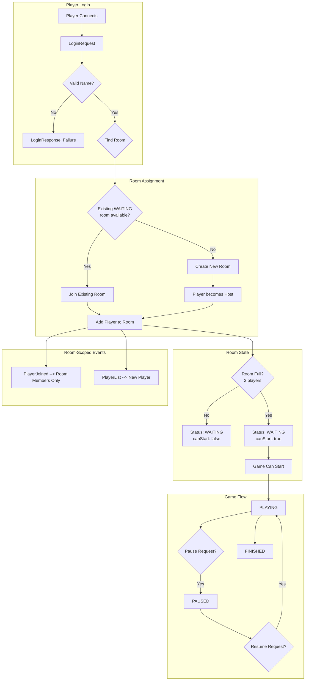

# Ping404

Ping404 is a multi-module Gradle project with these modules:
- `core`: shared game logic
- `desktop`: desktop client
- `android`: Android client
- `server`: dedicated game server
- `kryonet-client-server`: standalone networking module (namespace `no.creekcode.kryonet`)

## Prerequisites

- Java 17 (minimum)
- Gradle Wrapper (already included in this repository)
- Android SDK (required for Android build and Android unit tests)
- **For diagram viewing**: If using VS Code, install a Mermaid viewer extension:
  - **VS Code**: [Mermaid Preview](https://marketplace.visualstudio.com/items?itemName=vstirbu.vscode-mermaid-preview) or the [official Mermaid extension](https://marketplace.visualstudio.com/items?itemName=mermaidchart.vscode-mermaid-chart)
  - **Android Studio**: Does not have built-in Mermaid support; diagrams are primarily for documentation and can be viewed in VS Code or a browser-based markdown viewer

## Prerequisite Check Before Run Or Test

Run this first on any OS:

```bash
# Windows
.\gradlew.bat checkPrerequisites

# macOS or Linux
./gradlew checkPrerequisites
```

For Android-specific tasks, run:

```bash
# Windows
.\gradlew.bat checkAndroidPrerequisites

# macOS or Linux
./gradlew checkAndroidPrerequisites
```

The build is now wired so prerequisite checks run automatically before game run tasks and test tasks.

## Install Commands And Download Locations

### Java 17

Download:
- https://adoptium.net/temurin/releases/?version=17

Install commands:
- Windows: `winget install EclipseAdoptium.Temurin.17.JDK`
- macOS: `brew install --cask temurin@17`
- Ubuntu or Debian: `sudo apt-get update && sudo apt-get install -y openjdk-17-jdk`

### Android SDK

Download:
- Android Studio and SDK Manager: https://developer.android.com/studio
- Android command line tools: https://developer.android.com/studio#command-tools

Set SDK location with one of these:
- Environment variable `ANDROID_HOME`
- Environment variable `ANDROID_SDK_ROOT`
- `local.properties` in repo root with `sdk.dir=...`

Common SDK paths:
- Windows: `C:\Users\<user>\AppData\Local\Android\Sdk`
- macOS: `/Users/<user>/Library/Android/sdk`
- Linux: `/home/<user>/Android/Sdk`

Windows command example:

```powershell
setx ANDROID_HOME "%USERPROFILE%\AppData\Local\Android\Sdk"
```

macOS or Linux command example:

```bash
export ANDROID_HOME="$HOME/Library/Android/sdk" # macOS
export ANDROID_HOME="$HOME/Android/Sdk"         # Linux
```

## Troubleshooting Prerequisite Detection

If prerequisite checks fail, use the steps below.

### 1. Confirm Java is available

```bash
java -version
```

If this command fails, install Java 17 using the commands listed above.

### 2. Confirm Android SDK path exists

Windows PowerShell:

```powershell
Test-Path "$env:ANDROID_HOME"
Test-Path "$env:ANDROID_SDK_ROOT"
```

macOS or Linux:

```bash
test -d "$ANDROID_HOME" && echo "ANDROID_HOME ok"
test -d "$ANDROID_SDK_ROOT" && echo "ANDROID_SDK_ROOT ok"
```

If both are unset or invalid, set one variable and restart your terminal.

### 3. Configure local.properties fallback

Create or update `local.properties` in the repository root with:

```properties
sdk.dir=<absolute-sdk-path>
```

Example on Windows:

```properties
sdk.dir=C:\\Users\\<user>\\AppData\\Local\\Android\\Sdk
```

### 4. Re-run checks

```bash
# Windows
.\gradlew.bat checkPrerequisites

# macOS or Linux
./gradlew checkPrerequisites
```

For Android tasks:

```bash
# Windows
.\gradlew.bat checkAndroidPrerequisites

# macOS or Linux
./gradlew checkAndroidPrerequisites
```

Use:
- Windows: `gradlew.bat ...`
- macOS/Linux: `./gradlew ...`

## Run Order (Recommended)

1. Start the server.
2. Start client 1 (desktop or Android).
3. Start client 2 (desktop or Android).
4. Host from one client, join from the other.

**PS. Remember that in order to play the game, you must enter the player name first in the client.**

## Start Server And Clients

### Visual Studio Code

The repo already includes debug launch configurations in `.vscode/launch.json`.

1. Open the **Run and Debug** sidebar (`Ctrl+Shift+D`).
2. Use the dropdown at the top to select `Server`, then click the green play button (or press `F5`).
3. Select and start `Desktop Client 1` and `Desktop Client 2` the same way.
4. Or select `Server + 2 Clients` to launch all three at once.

**PS. Remember that in order to play the game, you must enter the player name first in the client.**

### Android Studio

The repo already includes run configurations in `.idea/runConfigurations/`.

1. **Create or select an Android emulator image** (if you don't have one):
   - **Tools** --> **Device Manager**
   - Click **Create Device** to set up a new virtual phone
   - Select a device profile (e.g., **Pixel 6**)
   - Choose **System Image**: **Android 15 (API 35)** - use AOSP (not Google APIs, not Play Store)
   - Configure:
     - **RAM**: 4GB or more
     - **Internal Storage**: 2GB
     - **SD Card**: 512MB (optional)
   - Click **Finish** and wait for the image to download and initialize

  

2. Before starting anything else, do this in Android Studio:
    - **File** --> **Sync Project with Gradle Files**
    - **Build** --> **Clean Project**
    - **Build** --> **Assemble Project** (if **Rebuild Project** is not available in your UI)
    - Uninstall the app from the emulator (optional but recommended), then run **Android Client** again.
3. Go to **File** --> **Open**, select the project root folder, and let Gradle sync complete.
4. In the main toolbar, click the configuration dropdown (left of the green play button) to see all configurations.

   

5. Start **Server** first.
6. For the clients, choose one of:
   - **Android Client**: Runs the game inside an emulator or connected device.
   - **Desktop Client 1 / 2**: Opens a separate game window on your PC.
7. Start a second client (Android or Desktop) to play multiplayer.
8. Or select **Server + 2 Clients** to launch server and two desktop clients at once.

**PS. Remember that in order to play the game, you must enter the player name first in the client.**

### Gradle (CLI)

Start server:

```bash
gradlew.bat :server:run
```

Start desktop client (run this in a separate terminal for each client):

```bash
gradlew.bat :desktop:run
```

Build server distribution and run it:

```bash
gradlew.bat :server:installDist
```

Then run:

- Windows: `server\build\install\server\bin\server.bat`
- macOS/Linux: `server/build/install/server/bin/server`

## Local Two-Client Testing Tip

If you test with two local clients on the same machine, turn off **Sound Effects** (or all audio) on one client to avoid doubled or echo-like audio.

If one client is an Android emulator and the server runs on your PC, use fo instance `10.0.2.2` (if that is your server IP, or if you are connecting to localhost from and Android Emulator) as server IP in the Android client (not `127.0.0.1`).

## References
- Sound effects are from: https://www.epidemicsound.com/sound-effects/search/
- Performance tactics and LibGDX usage summary: [PERFORMANCE_LIBGDX_SUMMARY.md](PERFORMANCE_LIBGDX_SUMMARY.md)
- Project requirements summary: [requirements.md](requirements.md)

## Testing

Most automated tests currently live in the `server` module and use JUnit 5.

Run all server tests:

```bash
gradlew.bat :server:test
```

Run all tests for all modules that define tests:

```bash
gradlew.bat test
```

Run tests continuously (re-runs after file changes):

```bash
gradlew.bat :server:test --continuous
```

Run verification lifecycle (includes tests):

```bash
gradlew.bat check
```

## Useful Commands

Clean build outputs:

```bash
gradlew.bat clean
```

Build all modules:

```bash
gradlew.bat build
```

## Networking

`NetworkServer` and `NetworkClient` (both in `core`) communicate over TCP using [KryoNet](https://github.com/EsotericSoftware/kryonet).

The standalone networking module is `kryonet-client-server`, with public API under `no.creekcode.kryonet`.
For module usage patterns and command registration API, see:
- `kryonet-client-server/src/main/java/no/creekcode/kryonet/readme.md`

See also: [Metrics System Overview](docs/metrics-overview.md)

- **Server** calls `start(tcpPort, udpPort)` to bind and listen. It pushes incoming events to registered `NetworkServer.ServerListener`s off the network thread. The listener methods always include a `PlayerConnection` argument so the server knows *which* client the event came from. Because it manages many clients at once.
- **Client** calls `connect(host, tcpPort, udpPort)` to connect to the server, then `sendTCP(packet)` to send data to it. Incoming events (connected, disconnected, received) are dispatched to registered `NetworkListener`s, here no `PlayerConnection` argument is needed because the client only ever talks to one server.
- Packets are plain Java objects registered with `PacketRegistry`. KryoNet serializes them automatically. Both sides must register the same packet classes in the same order.

## Runtime Metrics

During gameplay, you can view real-time performance metrics in a debug overlay.

### How to View Metrics

| Platform | Activation |
|----------|------------|
| Desktop  | Hold **SPACE** key |
| Android  | Touch screen with **3 fingers** |

The overlay appears in the top-left corner while the activation gesture is held.

### Metric Values

**Client-Side Metrics** (calculated locally):

| Metric | Description |
|--------|-------------|
| Client RTT | Round-trip time to server in milliseconds |
| Rx | Snapshot receive rate in Hz (how often game state updates arrive) |
| Jit | Snapshot jitter in milliseconds (variation in arrival timing) |

**Server-Side Metrics** (streamed via UDP at 1Hz):

| Metric | Description |
|--------|-------------|
| Srv Tick | Server simulation tick rate in Hz (default: 60Hz) |
| Bcast | Effective broadcast rate / max allowed (e.g., `30.0/30Hz`) |
| LoopJit | Current loop jitter / max allowed in ms (e.g., `0.5/16.0ms`) |
| InDrop | Percentage of incoming packets dropped due to queue overflow |
| OutDrop | Percentage of outgoing packets dropped |
| Queue | Current incoming packet queue depth |
| Bw | Outgoing bandwidth in bytes per second |

### Configuration

Runtime performance targets are configured in `server/src/main/resources/server.properties`:

```properties
game.simulationTickHz=60
game.maxStateBroadcastHz=30
game.maxLoopJitterMs=16.0
```

## GameRoom Flow

The `GameRoom` manages 2-player game sessions. Here's how the room lifecycle works:


*GameRoom Summary:* 
- **Login**: Validates player name, rejects duplicates/empty names
- **Room Assignment**: First player creates room (becomes host), second joins existing
- **Room State**: Waits for 2 players, then canStart() becomes true
- **Game Flow**: Cycles through WAITING --> PLAYING --> PAUSED ↔ PLAYING --> FINISHED
- **Events**: Notifications are scoped to room members only, not broadcast globally

## UI

 ### Figma Design
 We use figma to design and prototype the user interface.

 [View Figma Design](https://www.figma.com/design/6OVbMLWTUK2wPVBSSgEzwj/PING-404?m=auto&t=V1meK16OeSllh9yT-6)

 
---

### Functional Requirements

The following core features have been implemented:

#### Game Session Management
- Host and join multiplayer games
- Session code generation and joining
- Start game when both players are connected

#### Gameplay Mechanics
- Real-time two-player interaction
- Mallet movement within player boundaries
- Puck physics (movement, collision, rebound)
- Goal detection and scoring system

#### Game Flow
- Score tracking and display
- Game ends when score limit is reached
- Game Over screen with final score

#### Usability
- Pause and resume functionality
- Exit to main menu
- Player name display

---

### Not Implemented (Future Enhancements)

The following features were defined as low-priority extensions.

- **FR5.4: Visual Customization**
  - Players cannot yet customize mallets and pucks (e.g., colors, skins).

---
### Implemented

- A customization menu is available from the settings screen (UI only, functionality not yet implemented).

### Notes
- The UI follows a clean and minimal design approach
- Components are designed for reusability
- Consistent color palette and typography defined in Figma  

  ---