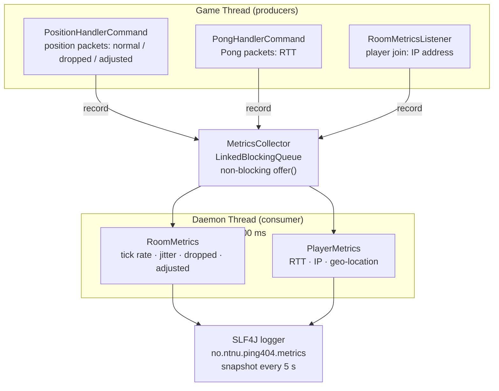

# Metrics System Overview

Related issue: #27 (Add measurements/metrics per room).

> **Viewing diagrams:** The flow diagram below uses [Mermaid](https://mermaid.js.org). It renders automatically on GitHub and in VS Code with the [Markdown Preview Mermaid Support](https://marketplace.visualstudio.com/items?itemName=bierner.markdown-mermaid) extension installed (open the preview with `Ctrl+Shift+V`). In Android Studio, install the [Mermaid plugin](https://plugins.jetbrains.com/plugin/20146-mermaid) from the JetBrains Marketplace, then use the built-in Markdown preview.

## Purpose

Collect runtime statistics per room without interfering with game logic. The game thread must never block on metrics work.

---

## Architecture Overview

### Pattern: Producer-Consumer

The metrics system is built on the **Producer-Consumer** pattern, which is the same pattern already used by `NetworkServer` to decouple KryoNet I/O from game handlers, and by `GameLoop` to decouple network input from game-tick processing.

The core idea is that the game thread (producer) never waits for metrics work to finish. Instead it places events on a shared queue and returns immediately. A separate daemon thread drains that queue in the background, aggregates the data, and emits log snapshots. This happens completely outside the game loop's awareness.

This keeps the metrics concern fully outside the hot path, meaning a slow geo-lookup or a heavy log write can never cause a position packet to be delayed.

### Flow

**Three event types** emitted onto the queue (all implement sealed interface `MetricEvent`):

| Event | Emitted by | Carries |
|---|---|---|
| Position update | `PositionHandlerCommand` | Room, connection, timestamp, dropped flag, adjusted flag |
| Ping latency | `PongHandlerCommand` | Room, connection, round-trip time (ms) |
| Player joined | `RoomMetricsListener` | Room, connection, IP address |

---

## Key Design Decisions

| Decision | Rationale |
|---|---|
| Non-blocking `offer()` | Game thread never stalls |
| `flush()` synchronous in tests | Makes unit tests deterministic |
| `GeoLocationService` is an interface | Can be swapped out; `NoOpGeoLocationService` is the safe default |
| One `MetricsCollector` per server | Room stats stored internally, keyed by `roomId` |
| Separate logger name | Operators can route the metrics log independently of the game log |

---

## What Is Measured

- **Tick rate**: actual update frequency per room
- **Jitter**: variation in arrival time per connection
- **Queue depth**: number of buffered events
- **Dropped / adjusted updates**: how often game logic ignored or clamped a position
- **RTT**: ping round-trip per player
- **IP and geo-location**: captured on connection
